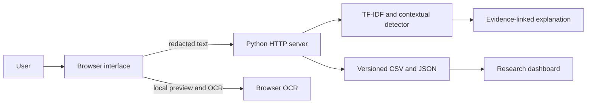
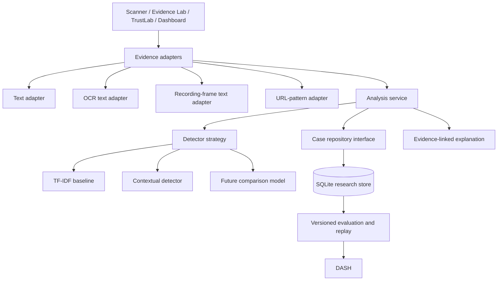

# ScamShield architecture

## Current system

The current implementation is intentionally small. Browser code handles the interface and local media workflow. The Python server exposes analysis, dashboard and constrained public-URL metadata endpoints. Versioned files contain training, evaluation, synthetic and public-context data.

## Target architecture for Sprints 2–3

### Intended patterns

- **Strategy:** each detector implements the same analysis contract, allowing controlled comparison without conditional logic throughout the application.
- **Adapter:** text, OCR output, recording-frame output and URL-pattern evidence are converted into one validated evidence representation.
- **Repository:** application services depend on a storage interface rather than SQLite details, enabling isolated tests and future storage changes.

These patterns are target decisions, not a claim about the present code. Their implementation and tests are Sprint 2 acceptance criteria.

## Current trust boundaries

- Uploaded images and recordings are previewed in the browser.
- OCR output must be reviewed before text is analysed.
- The server receives analysed text, not raw uploaded media, in the current design.
- Public URL inspection accepts only public HTTP(S) destinations and returns technical metadata, not a reputation verdict.
- Measured evaluation, synthetic demonstrations and public context use separate data sources and labels.
