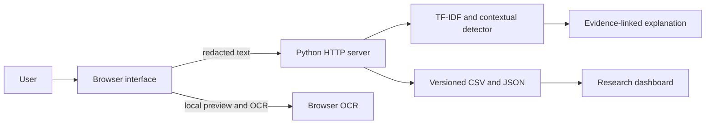
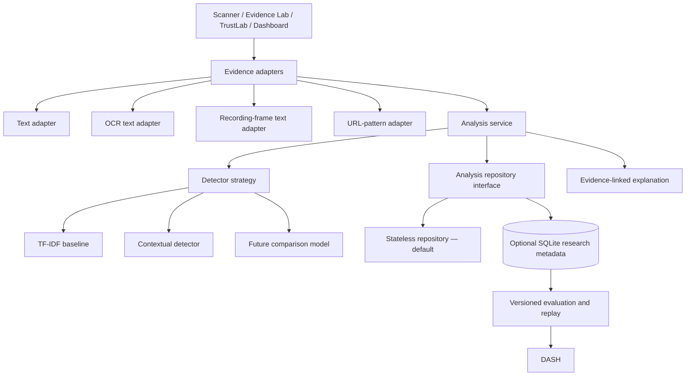
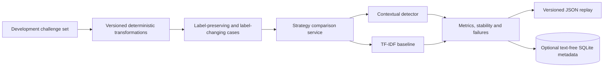

# ScamShield architecture

## Current system

The current implementation is intentionally small. Browser code handles the interface and local media workflow. The Python server exposes analysis, dashboard and constrained public-URL metadata endpoints. Versioned files contain training, evaluation, synthetic and public-context data.

## Implemented Sprint 2 application boundaries

### Implemented patterns

- **Strategy:** `ContextualDetectorStrategy` and `TfidfBaselineStrategy` implement the same analysis contract, allowing controlled comparison without conditional logic throughout the server.
- **Adapter:** pasted text, reviewed screenshot OCR and reviewed recording-frame OCR are converted into one validated `EvidenceItem` representation.
- **Repository:** `AnalysisService` depends on an `AnalysisRepository` contract. `NullAnalysisRepository` keeps the deployed default stateless; `SqliteAnalysisRepository` stores optional research metadata.

The live `/api/analyse` route now uses the Adapter → Service → Strategy flow. Existing contextual output fields are regression-tested for equivalence. The URL metadata checker remains separate because it inspects a public destination rather than message evidence.

`StrategyComparisonService` runs the contextual and TF-IDF baseline strategies against the same immutable evidence item. The reproducible evaluation uses this service so compared decisions cannot silently come from different input rows.

## Sprint 3 TrustLab replay

TrustLab is a development robustness harness, not a new source of independent performance evidence. It applies declared transformations, keeps each expected-label relationship explicit, and evaluates both strategies on paired evidence. The module rejects the final held-out filename to reduce accidental leakage. The replay export contains outcome metadata and text digests rather than transformed message text.

See [ADR 0004](adr/0004-trustlab-metamorphic-testing.md) for the decision and limitations.

See [`data_model.md`](data_model.md) for the schema and retention boundary.

## Current trust boundaries

- Uploaded images and recordings are previewed in the browser.
- OCR output must be reviewed before text is analysed.
- The server receives analysed text, not raw uploaded media, in the current design.
- Live analysis is stateless by default. Optional SQLite recording requires `SCAMSHIELD_RESEARCH_DB` and stores no raw text or media.
- Public URL inspection accepts only public HTTP(S) destinations and returns technical metadata, not a reputation verdict.
- Measured evaluation, synthetic demonstrations and public context use separate data sources and labels.
