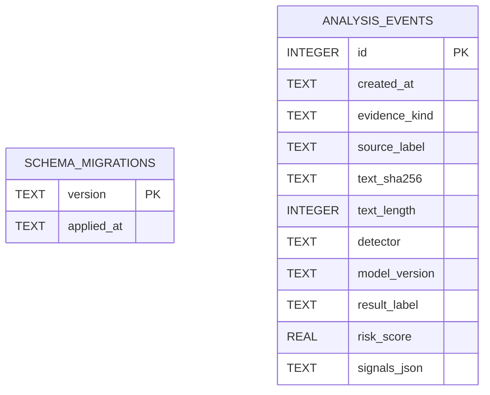

# ScamShield research data model

## Purpose and boundary

The SQLite component provides reproducible data-engineering evidence for controlled research runs. It is not a user-message archive. The deployed application remains stateless unless `SCAMSHIELD_RESEARCH_DB` is explicitly configured.

The repository stores a one-way SHA-256 digest, message length, evidence kind, allow-listed source label, detector version and result metadata. It does **not** store message text, screenshots, recordings, OCR images, names, account details or URLs. Caller-supplied source labels outside the fixed allow-list are replaced with the adapter's safe default.

## Entity relationship diagram

`schema_migrations` records each applied SQL file. `analysis_events` deliberately has no relationship to a user, session or raw evidence table.

## Migration process

Migrations are ordered SQL files under `migrations/`. `SqliteAnalysisRepository` creates the migration register, applies each unseen file once and records its filename. Tests create a fresh database, apply the migrations twice and verify that only one migration record exists.

## Retention and privacy

- Default runtime: no database and no analysis history.
- Optional research runtime: metadata only.
- Digests help detect repeated controlled cases but must still be treated as derived data.
- No claim of anonymity is made.
- Any future storage of raw evidence requires a separate consent, retention, access and deletion design.
